# Hi, 👋 I'm Jonathas

Desenvolvedor **Backend .NET | Java | APIs | Microsserviços | Azure | Docker | Kafka | RabbitMQ**

Atuo na construção de APIs escaláveis, seguras e de alta performance, aplicando boas práticas como **Clean Architecture, DDD e SOLID**, com experiência em todo o ciclo de desenvolvimento — da modelagem ao deploy em ambientes cloud.

- 🔭 Atualmente na **Semantix** como Analista de Desenvolvimento de Sistemas II
- 🏗️ Foco em **arquitetura distribuída, microsserviços e integrações entre sistemas críticos**
- ☁️ Experiência com **Azure, Docker, Kubernetes e CI/CD (Azure DevOps)**
- 📨 Mensageria com **RabbitMQ e Kafka** para arquiteturas assíncronas e resilientes
- 🗄️ Bancos de dados **SQL Server e Oracle**
- 💬 Pergunte-me sobre **.NET, C#, APIs REST, Microsserviços, Docker/Kubernetes, Azure**
- 📫 Me encontre no GitHub: [@Jonathas3](https://github.com/Jonathas3) · [LinkedIn](https://www.linkedin.com/in/jonathas-c-santos-43b16922b)

---

  
  

---

### 🛠️ Tecnologias

**Linguagens & Frameworks**

**Cloud, DevOps & Infraestrutura**

**Mensageria & Dados**

**Arquitetura & Boas Práticas**

`Clean Architecture` · `DDD` · `SOLID` · `Design Patterns` · `Microsserviços`

---

### 🔥 Streak de Contribuições

